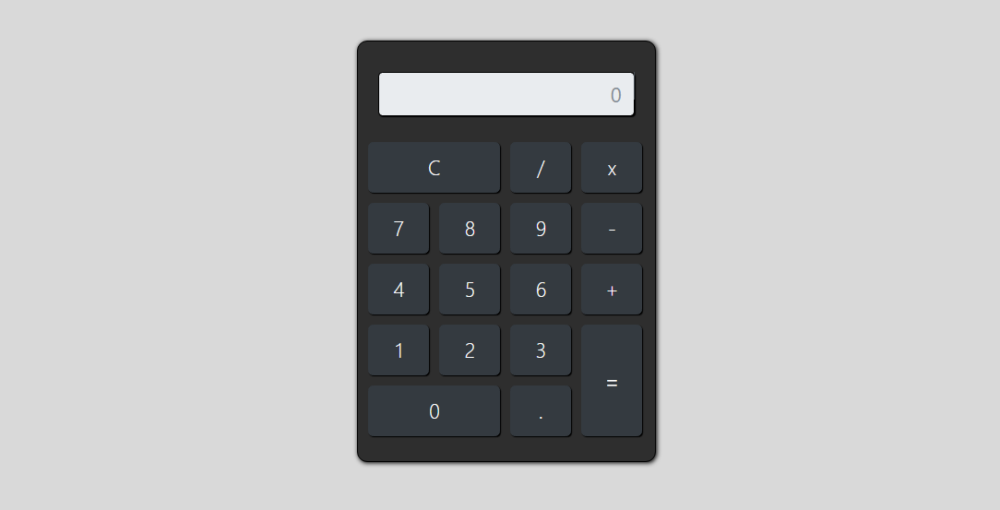

# App Calculadora 📈
Este é um projeto de ```calculadora simples``` desenvolvida com ```HTML, CSS e JavaScript```, utilizando o ```Bootstrap``` para estilização.

<hr>

### 🚀 Tecnologias Utilizadas
>***HTML5***, ***CSS3***, ***Bootstrap 4***, ***JavaScript***

##

### 📌 Funcionalidades
✅ Operações básicas: **adição (+), subtração (-), multiplicação (x) e divisão (/)**;<br>
✅ Uso do **ponto decimal (.)**;<br>
✅ Botão **C** para limpar o visor;<br>
✅ Exibição dos cálculos em tempo real.



<hr>

### 🛠️ Como Usar
**1.** Clone este repositório:
   ```sh
   git clone https://github.com/seu-usuario/calculadora
   ```
**2.** Abra o arquivo `index.html` no seu navegador;<br>
**3.** Utilize os botões para realizar cálculos normalmente.

##

### 📝 Estrutura do Código
O código está organizado da seguinte forma:
- **HTML**: Estrutura da calculadora e botões.
- **CSS**: Estilização com Bootstrap e customizações manuais.
- **JavaScript**: Função `calcular(tipo, valor)` para capturar os valores e executar operações matemáticas usando `eval()`.

---

>### 📌 Melhorias Futuras
>🔹 Melhorar a responsividade para telas menores  
>🔹 Adicionar suporte a teclado  
>🔹 Implementar um modo claro/escuro

---

💡 **Dúvidas ou sugestões?** Entre em contato ou contribua para o projeto!
